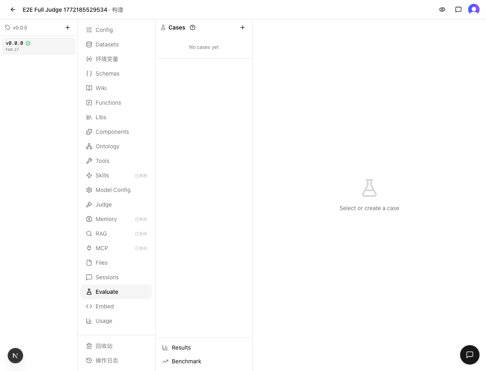

# 发布检查报告：v0.3.1 — 3 个 Eval P0 缺陷修复

> 检查时间：2026-03-03 12:20
> 关联集成：[INTEGRATE.md](INTEGRATE.md)
> 分支：`dev` → `main`

## 1. Regression（回归验证）

### 静态检查
- `make typecheck`：通过
- `make test`：通过（126 文件 / 1429 用例）

### 结果
✅ 通过

## 2. Cross-feature（交叉验证）

### 验证场景

| 场景 | 涉及功能 | 结果 |
|------|---------|------|
| Judge Prompt Template 创建/编辑/恢复默认 | 修复 #1 (snapshot 字段补全) + 修复 #2 (templateData 隔离) | ✅ E2E 通过 |
| Batch x3 重复运行 + 评分聚合 + 报告页 | 修复 #1 (batch snapshot) + 修复 #3 (事务化) | ✅ E2E 通过 |
| Eval 页面加载 + UI 无 JS 错误 | 全部修复 + schema 变更 | ✅ 正常 |

### 证据

| 验证项 | 截图 |
|--------|------|
| Eval Build 页面 |  |
| E2E 测试 3/3 通过 |  |

### 结果
✅ 通过

## 3. Migration（迁移安全）

### Schema 变更
- `evalRuns` 表新增 `judgeVersionId: uuid("judge_version_id")`（nullable，向后兼容）
- 迁移文件已生成：`drizzle/0007_odd_frank_castle.sql`
- 内容：`ALTER TABLE "eval_runs" ADD COLUMN "judge_version_id" uuid;`
- 风险评估：新增可选列，无数据丢失风险，旧记录 null 值已在 execute-case.ts 做兼容处理

### Migration 文件
已生成并包含在 dev 分支中，Vercel 构建时 `db:migrate` 会自动应用

### 导出格式兼容性
无破坏性变更，无新增导出迁移文件

### 结果
✅ 安全

## 4. Release Notes（发布说明）

### 缺陷修复
- **Batch 评估自定义 Judge 模板生效**：Batch 模式下自定义的 Judge Prompt Template 和 Turn Prompt Template 不再被静默忽略，与单次 Run 模式行为一致
- **Judge Agent 使用自身数据渲染提示词**：Judge Agent 的 System Prompt 现在使用 Judge Agent 自身的数据集/Wiki 渲染模板变量，而非错误地使用被评估 Agent 的数据
- **评估配置快照事务化**：创建 Eval Run/Batch 时的配置读取和记录写入现在在 Repeatable Read 事务中执行，消除并发修改导致的配置不一致风险

### 其他
- Worktree 删除时自动清理关联 git 分支
- Vercel 构建配置跳过 dev/worktree 分支

## 5. Verdict（裁定）

### 判决
✅ 发布

### 证据摘要
- **Regression**：typecheck 通过 + 1429 个单元测试全部通过
- **Cross-feature**：eval-judge-prompt-template + eval-batch-repeat E2E 全流程通过
- **Migration**：新增 nullable 列，迁移文件已就绪，零风险

### 阻塞项
无

### Follow-up 清单
- Batch existingRunningBatch 并发检查仍在事务外，存在 TOCTOU 竞态（独立缺陷，不影响本次发布）
