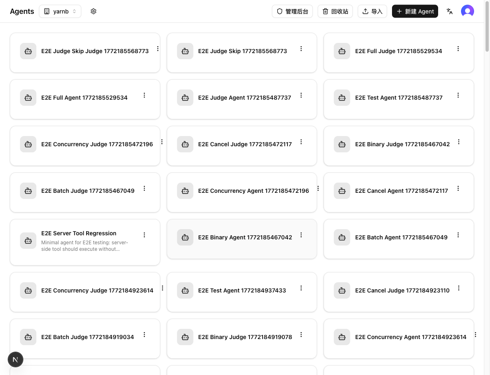
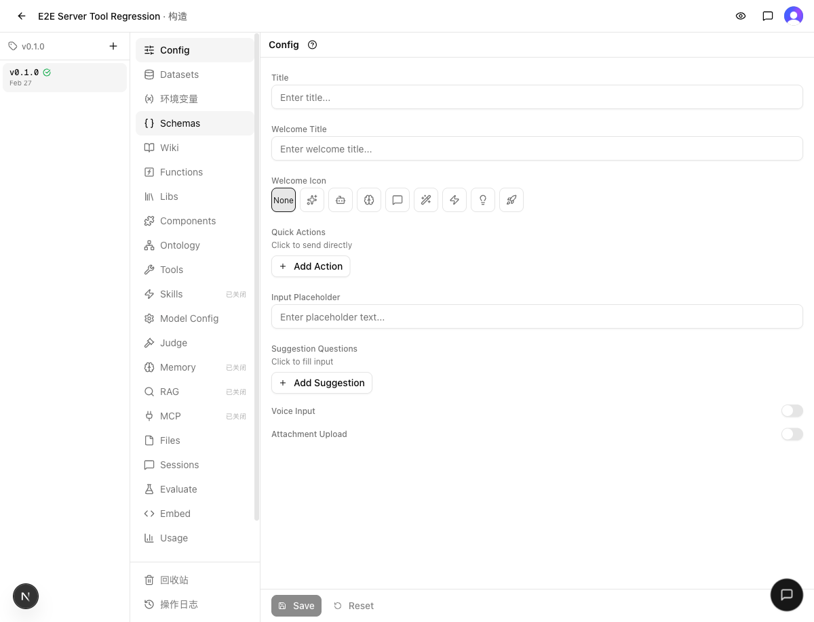
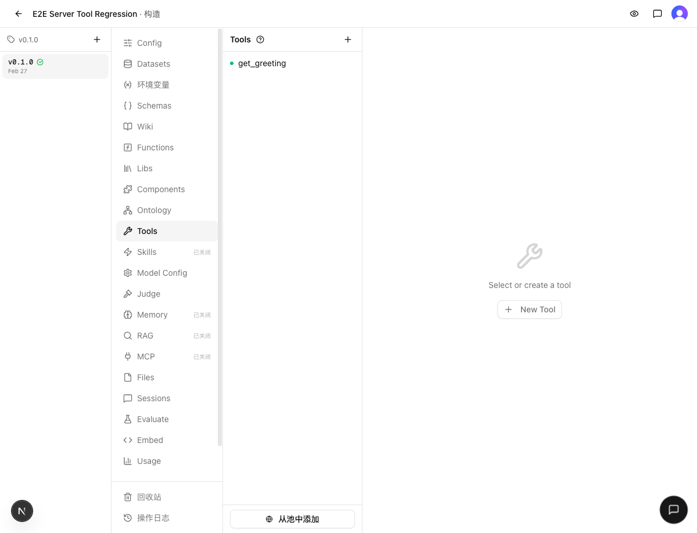

# 发布检查报告：3 个 P0 安全修复 + Admin 面板 / 工作流基础设施重构

> 检查时间：2026-03-02 21:40
> 关联集成：[INTEGRATE.md](INTEGRATE.md)
> 分支：`dev` → `main`

## 1. Regression（回归验证）

### 静态检查
- `make typecheck`：✅ 通过
- `make test`：✅ 114/116 文件通过（1306/1312 用例通过）
  - 2 个失败文件（`partial-unique-index.test.ts` 5 用例 + `seed-idempotency.test.ts` 1 用例）为数据库集成测试，需要本地 DB 连接，**main 分支同样失败**——非本次变更引入的回归

### 结果
✅ 通过（失败用例为既有问题，非回归）

## 2. Cross-feature（交叉验证）

### 验证场景
| 场景 | 涉及功能 | 结果 |
|------|---------|------|
| 登录 → Agent 列表加载 | Auth + Agent CRUD + 安全修复后的 API | ✅ 通过 |
| Agent 卡片菜单 → 构建页导航 | Agent 路由 + 版本系统 + UI 完整性 | ✅ 通过 |
| 构建页 Tools 管理 | 版本隔离 + 工具列表 + 安全修复后的测试端点 | ✅ 通过 |

### 证据
| 验证项 | 截图 |
|--------|------|
| Agent 列表正常加载 |  |
| 构建页完整导航 |  |
| Tools 管理正常 |  |

### 结果
✅ 通过

## 3. Migration（迁移安全）

### Schema 变更
- 无：`web/src/db/schema.ts` 无修改

### Migration 文件
- 无需生成：`drizzle/` 无变更

### 导出格式兼容性
- 无：`web/src/lib/versions/migrations/` 无变更，无版本碰撞风险

### 结果
✅ 安全

## 4. Release Notes（发布说明）

### 安全修复
- 修复版本发布接口跨 Agent 越权漏洞（P0）
- 修复 Wiki 查询跨 Agent 数据泄露漏洞（P0）
- 修复工具/函数测试端点未授权代码执行漏洞（P0）

### 新功能
- Archon Admin 本地管理面板：任务状态管理、分支对比、终端操作、报告查看
- 完整技能链体系：缺陷链（诊断→修复→验证→守护）、发布链（集成→发布→归档）
- 版本对比查看器、链路报告查看器、元认知反思技能
- Cloudflare Pages 部署支持

### Bug 修复
- 动态渲染器 import 错误修复
- 流式响应新建对话修复
- 聊天链接渲染支持
- 数据集模板渲染修复
- Agent 导入功能修复
- Eval Cases 去重（versionId 过滤）
- code-scanner parse 失败时不再误报通过

### 重构
- scripts/ 从 sh 迁移到 mjs + 按职责拆分子目录
- Admin 后端从 .mjs 迁移到 .ts
- todo/issues 数据从技能目录移至项目根目录
- 工作区目录结构从 `.worktree/` 拆分为 `.task/` + `.release/`

## 5. Verdict（裁定）

### 判决
✅ 发布

### 证据摘要
- **Regression**：typecheck 通过 + 1306/1312 测试通过（6 个失败为既有 DB 集成测试问题，main 分支同样失败）
- **Cross-feature**：登录、Agent 列表、构建页、Tools 管理全部正常，安全修复未影响合法操作
- **Migration**：无 schema 变更、无导出格式变更，零迁移风险

### 阻塞项
无

### Follow-up 清单
- 修复 `partial-unique-index.test.ts` 和 `seed-idempotency.test.ts` 的 DB 连接依赖问题（既有技术债，非本次引入）
- issues/ 目录仍有 30+ 个 open issues 待处理（含多个安全相关）
