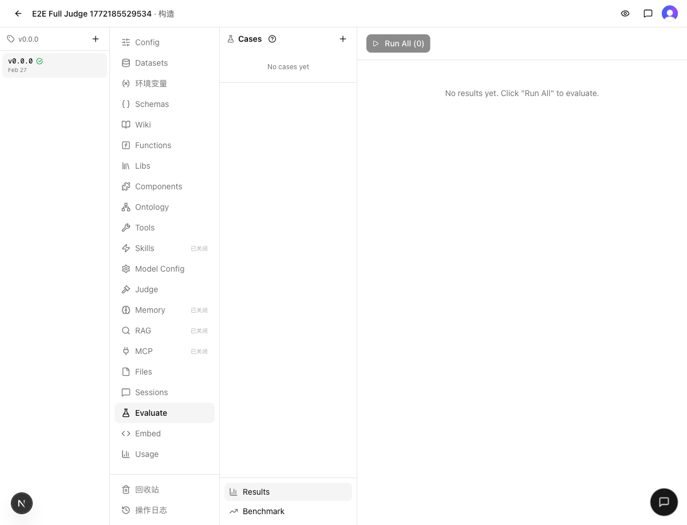
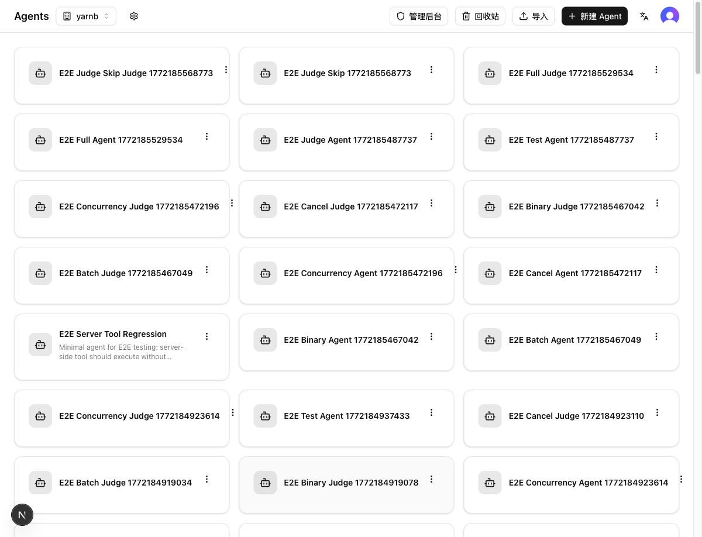

# 发布检查报告：4 项 P0 任务 + 基础设施增强

> 检查时间：2026-03-02 16:40
> 关联集成：[INTEGRATE.md](INTEGRATE.md)
> 分支：`dev` → `main`

## 1. Regression（回归验证）

### 静态检查
- `make typecheck`：✅ 通过
- `make test`：✅ 通过（121 文件 / 1381 用例）

### 修复项
- `diff-guard.test.ts` 中 `route.ts 仅导出 GET 方法` 测试因动态 import Next.js API route 模块（含 DB 依赖传递链）超时（默认 5s），已将超时调整为 30s

### 结果
✅ 通过

## 2. Cross-feature（交叉验证）

### 验证场景
| 场景 | 涉及功能 | 结果 |
|------|---------|------|
| Build 页面 + Eval tab 渲染 | eval-result-show-tool-output + 构建页框架 | ✅ 正常加载 |
| Agent 列表 + 导航 | 全局路由 + Agent 管理 | ✅ 正常加载 |

### 证据
| 验证项 | 截图 |
|--------|------|
| Eval tab 正常渲染 |  |
| Agent 列表正常渲染 |  |

### 风险评估
- 3/4 任务为纯单元测试，**零业务代码修改**，无跨功能交互风险
- eval-result-show-tool-output 仅修改 `ResultCard` 组件和 `ChatMessage.toolCalls` 类型定义，影响范围极小
- 安全增强（鉴权守护）为新增校验，不影响正常使用路径

### 结果
✅ 通过

## 3. Migration（迁移安全）

### Schema 变更
无 — `web/src/db/schema.ts` 和 `drizzle/` 无变更

### Migration 文件
不需要 — 无 schema 变更

### 导出格式兼容性
无破坏性变更 — `web/src/lib/versions/migrations/` 和 `types.ts` 无变更

### 结果
✅ 安全

## 4. Release Notes（发布说明）

### 新功能
- **Eval 结果展示工具调用输出**：评估运行结果中可查看工具调用的实际返回值，完整理解 Agent 推理链路

### 测试覆盖
- **Chat 持久化层**：12 项验收标准，覆盖 session 创建、消息保存/加载、并发写入安全性
- **Agent 导入导出与快照**：31 个测试，覆盖 buildSnapshot、restoreSnapshot、copy-resources 和 import 路由鉴权
- **Chat 流式执行核心逻辑**：24+ 个测试，覆盖工具三源发现、Memory/RAG 注入、模板渲染、压缩触发

### 安全增强
- 版本 publish/rollback 所有权检查
- Tool/Function test 端点鉴权（需传入 agentId）
- Import 路由改为 Blob 上传（绕过 4.5MB 限制）
- Wiki 数据 agentId 隔离
- Dataset 查询 versionId 过滤

### 基础设施
- Worktree 脚本从 shell 迁移到 Node.js + 单元测试
- Admin 管理面板（Next.js）
- 15+ 新技能（发布链路、需求/缺陷链路、守护测试等）
- 版本差异对比查看器

### 其他
- 链路编排技能补充 AskUserQuestion 工具权限
- worktree 创建时清除 NODE_ENV 确保 devDependencies 安装
- 平台定位文档更新

## 5. Verdict（裁定）

### 判决
✅ 发布

### 证据摘要
- **Regression**：typecheck + 1381 测试全部通过
- **Cross-feature**：3/4 任务为纯测试无业务代码修改，Eval/Build/Agent 页面正常渲染
- **Migration**：无 Schema/导出格式变更，无需迁移

### 阻塞项
无

### Follow-up 清单
- 清理 E2E 测试残留 Agent（非阻塞，仅影响 dev 环境整洁度）
- `diff-guard.test.ts` 动态 import 超时问题后续可考虑改用静态分析替代运行时 import
