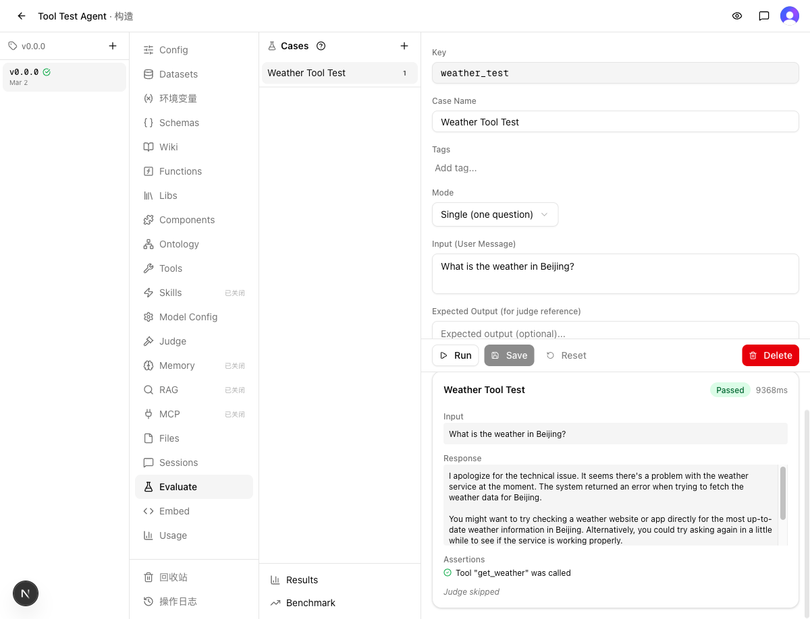
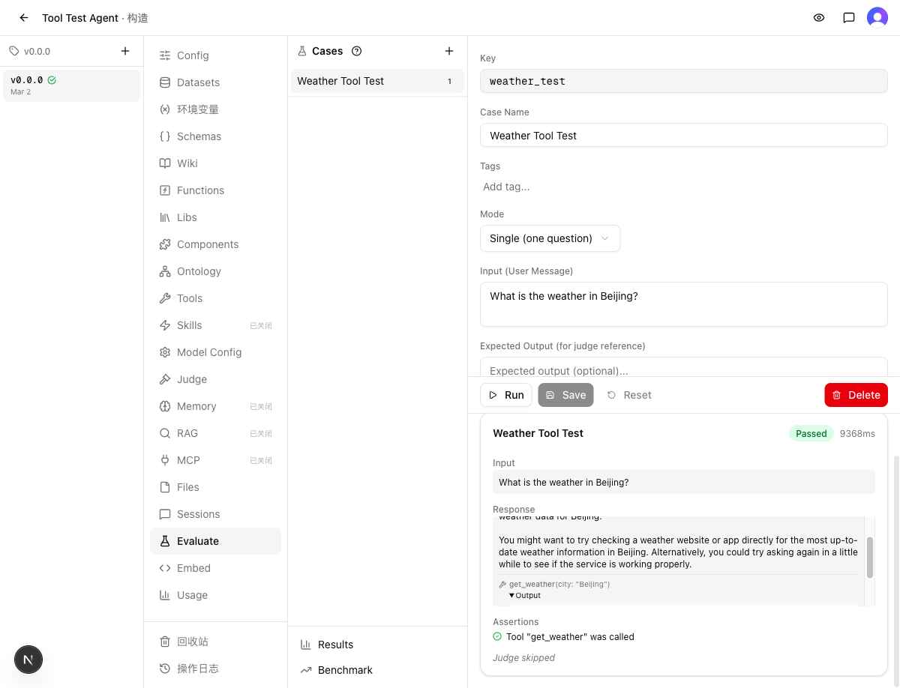

# 验收报告：评估结果中展示工具调用输出

> 验收时间：2026-03-02 16:20
> 关联需求：[REQ.md](REQ.md)
> 关联实现：[IMPL_REPORT.md](IMPL_REPORT.md)
> 分支：`dev-eval-result-show-tool-output-20260302`

## 1. Criteria Verdict（标准裁定）

### 逐项核对

| # | 验收标准 | 结论 | 偏差说明 |
|---|----------|------|----------|
| 1 | `ChatMessage.toolCalls` 类型包含可选的 `result` 字段 | ✅ 通过 | — |
| 2 | eval 运行后 chatMessages 中 toolCalls 包含 result 数据 | ✅ 通过 | E2E 验证：运行 eval 后工具输出确实存在于结果中 |
| 3 | ResultCard 单轮模式可展开查看输出内容 | ✅ 通过 | E2E 验证 + 单元测试 |
| 4 | ResultCard 多轮模式可展开查看输出 | ✅ 通过 | 单元测试验证（4 个用例） |
| 5 | 工具输出默认折叠，点击后展开 | ✅ 通过 | `
` 默认关闭，点击 Output 后展开 |
| 6 | 无工具输出时不显示展开入口 | ✅ 通过 | 单元测试验证 |
| 7 | 现有 eval 运行流程、断言逻辑不受影响 | ✅ 通过 | 断言 "Tool get_weather was called" 正常通过 |

### 证据

| 验证项 | 截图 |
|--------|------|
| eval 运行完成，工具调用名+参数显示正常，断言通过 |  |
| 点击 Output 展开工具返回结果 |  |

### 结果
✅ 全部通过（7/7 条）

## 2. Experience Validation（体验验证）

### 用户旅程
以 FDE 视角完整走了一遍：创建 Agent → 配置模型 → 添加工具（get_weather）→ 创建 eval case → 运行评估 → 查看结果。

结果卡片中：
1. 工具调用行 `🔧 get_weather(city: "Beijing")` 清晰展示
2. 下方出现 "▶ Output" 可折叠标签
3. 点击展开后显示工具返回的 JSON 内容
4. 再次点击可折叠回去

### 四维度评估

| 维度 | 结果 | 说明 |
|------|------|------|
| Happy Path | ✅ | 运行 eval → 查看结果 → 展开工具输出，全链路通畅 |
| 流程衔接 | ✅ | Output 标签紧跟在工具调用行下方，位置直觉正确，无需寻找 |
| 认知负荷 | ✅ | 默认折叠不干扰阅读，需要时一键展开，无需额外说明 |
| 异常恢复 | ✅ | 工具返回错误时（如 handler 执行错误）也能正确展示错误信息 |

### 标准覆盖反馈
无遗漏。

### 结果
✅ 通过
体验流畅，Output 展开/折叠交互直觉且不干扰正常阅读。

## 3. Gap Assessment（缺口评估）

### 声明的缺口

| 缺口 | 类型 | 影响面 | 严重度 | 紧迫度 | 判定 |
|------|------|--------|--------|--------|------|
| 历史 eval 数据不含 result（保存时已丢弃） | 限制 | 仅影响已有旧数据 | 极端情况 | 可搁置 | ✅ |
| 大输出限制 200px 高度需滚动 | 限制 | 超长输出场景 | 体验瑕疵 | 可搁置 | ✅ |

### 发现的缺口
无

### 结果
✅ 可接受
两个声明缺口均不影响核心功能，可搁置。

## 4. Regression Result（回归验证）

### 静态检查
- `make typecheck`：通过
- `make test`：120 文件通过 / 1 文件失败（`diff-guard.test.ts` 预存问题，stash 验证确认与本次变更无关）

### Constraint 合规
| # | 约束 | 结果 |
|---|------|------|
| 1 | 展示运行时实际返回数据，不做加工 | ✅ 未违反 |
| 2 | ChatMessage 向后兼容（可选字段） | ✅ 未违反 |
| 3 | 无 DB schema 迁移 | ✅ 未违反 |
| 4 | extractToolCalls 保留 result | ✅ 未违反 |
| 5 | 工具名称参数展示不变 | ✅ 未违反 |
| 6 | 断言逻辑不变 | ✅ 未违反 |
| 7 | 注入 toolCalls 处理不变 | ✅ 未违反 |

### Change Set 区域验证
| 区域 | 实现报告声明 | 实际验证结果 |
|------|-------------|-------------|
| types.ts | 增加 result?: unknown | ✅ 正常，类型检查通过 |
| execute-case.ts | 5 处 map 增加 result | ✅ 正常，单元测试覆盖 |
| result-card.tsx | ToolCallEntry 组件 | ✅ 正常，E2E + 单元测试验证 |

### 结果
✅ 通过
唯一的测试失败（diff-guard.test.ts）经 git stash 验证为预存问题，非本次变更引入。

## 5. Verdict（裁定）

### 判决
✅ 合并

### 证据摘要
- **Criteria Verdict**：7/7 条验收标准全部通过
- **Experience Validation**：FDE 视角完整走通，工具输出展示直觉且不干扰
- **Gap Assessment**：2 个已知缺口均不阻塞，可搁置
- **Regression**：typecheck 通过，测试无新增回归

### 阻塞项
无

### Follow-up 清单
无

## 过程备注

[环境] 首次运行 eval 时工具名 "Get Weather" 含空格导致 API 报错（DeepSeek 不允许），修正为 "get_weather" 后成功
[环境] 工具 handler 使用 `return` 语句导致 "return outside of function" 错误，但错误信息本身被正确捕获并展示在 Output 中，反而验证了功能的健壮性
[确认] diff-guard.test.ts 失败通过 git stash 确认为预存问题
