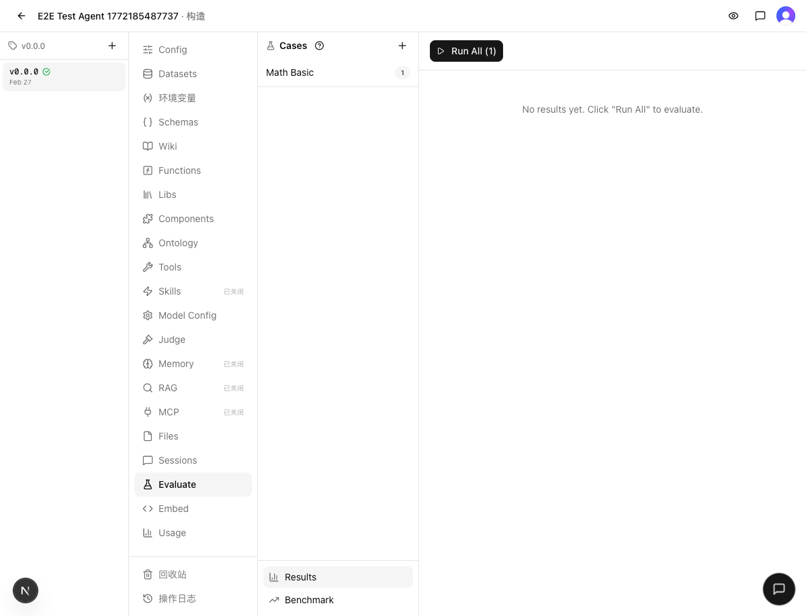
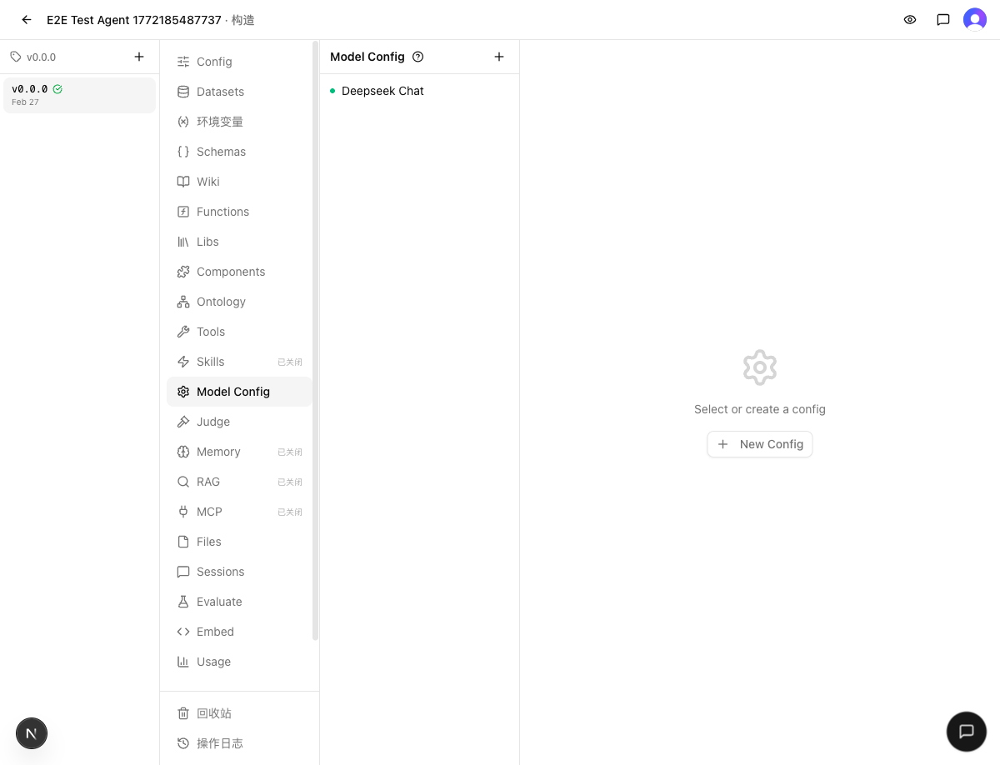

# 发布检查报告：v0.3.0 — Eval Run versionId 快照

> 检查时间：2026-03-02 18:35
> 关联集成：[INTEGRATE.md](INTEGRATE.md)
> 分支：`dev` → `main`

## 1. Regression（回归验证）

### 静态检查
- `make typecheck`：通过
- `make test`：通过（122 文件 / 1390 用例）

### 结果
✅ 通过

## 2. Cross-feature（交叉验证）

### 验证场景
| 场景 | 涉及功能 | 结果 |
|------|---------|------|
| Evaluate 页面加载 + Cases 列表 | Eval UI + Build 导航 | ✅ 正常 |
| Model Config 列表加载 | Model Config + Build 导航 | ✅ 正常 |
| Agents 列表页 + 登录 | Auth + 首页 | ✅ 正常 |

### 证据
| 验证项 | 截图 |
|--------|------|
| Evaluate 页面 + Cases + Results |  |
| Model Config 页面 |  |

### 结果
✅ 通过

本次只有 1 个工作区变更（eval versionId 快照），不涉及多模块交互。Eval 页面加载正常，Cases 可见，Results 面板正常，Build 其他 Tab 无影响。

## 3. Migration（迁移安全）

### Schema 变更
- **有**：`evalRuns` 表新增 `chat_version_id` 列（uuid, nullable）
- 评估：安全。Nullable 列新增不影响现有数据，旧 run 的 `chatVersionId` 为 null，代码已处理 null 安全短路

### Migration 文件
- ✅ 已生成：`web/drizzle/0006_numerous_rumiko_fujikawa.sql`
- 内容：`ALTER TABLE "eval_runs" ADD COLUMN "chat_version_id" uuid;`

### 导出格式兼容性
- 无变更。`web/src/lib/versions/migrations/` 和 `web/src/lib/versions/types.ts` 无修改

### 结果
✅ 安全

## 4. Release Notes（发布说明）

### 新功能
无

### 缺陷修复
- **Eval 配置漂移修复**：修复了 Eval Run 运行期间如果用户切换 Agent 版本，后续 case 可能使用不同版本 tools/templateData 的问题。现在 Run 创建时快照 versionId，确保所有 case 使用一致的配置执行。

### 其他
无

## 5. Verdict（裁定）

### 判决
✅ 发布

### 证据摘要
- **Regression**：typecheck + 1390 测试全部通过
- **Cross-feature**：Eval 页面和 Build 核心功能正常，无跨模块冲突
- **Migration**：Nullable 列新增，迁移文件已生成，安全

### 阻塞项
无

### Follow-up 清单
- Judge agent versionId 未做同样的快照处理（低优先级 tech debt）
