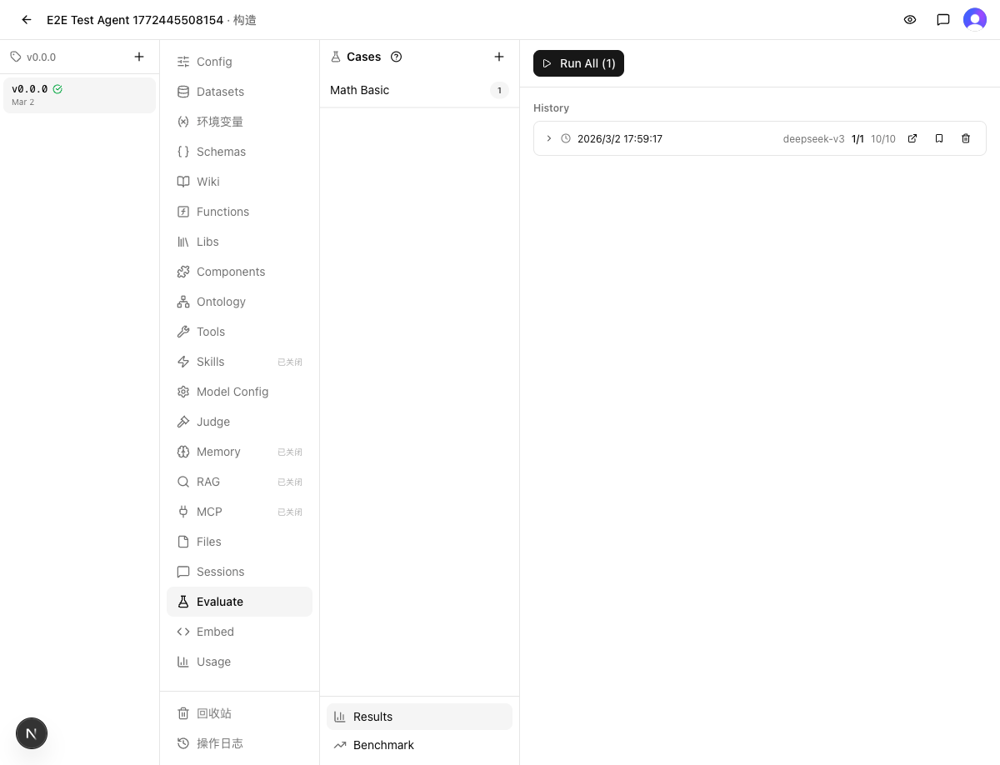
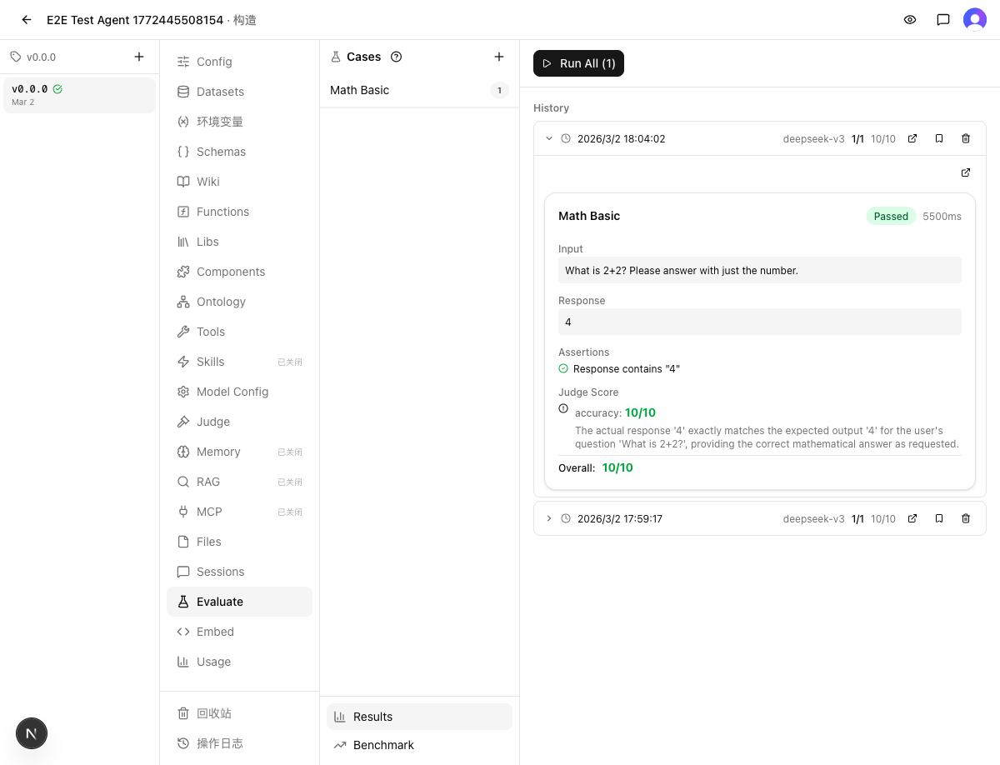

# 验证报告：Eval Run versionId 快照消除配置漂移

> 验证时间：2026-03-02 12:25
> 关联修复：[FIX_REPORT.md](FIX_REPORT.md)
> 关联缺陷：[DEFECT.md](DEFECT.md)
> 分支：`dev-eval-run-versionid-drift-20260302`

## 1. Reproduction Result（复现验证）

### 验证方式
此缺陷为代码级竞态条件（需要在 eval run 运行期间切换 agent 版本），通过代码审查确认修复数据流：

1. `route.ts:57` → `resolveEditingVersionId(agentId)` 返回 versionId
2. `route.ts:120` → `chatVersionId: versionId` 写入 run 记录
3. `execute-case.ts:135` → `run.chatVersionId ?? undefined` 读取快照值
4. `execute-case.ts:136` → `gatherTemplateData(evalAgentId, evalVersionId)` 用快照 versionId 加载资源
5. `execute-case.ts:154-158` → tools 查询用快照 versionId

### 结果
✅ 通过

修复后 `execute-case.ts` 不再 import 或调用 `resolveEditingVersionId`，完全从 run 快照读取 versionId。即使 `agents.editingVersionId` 在执行期间变化，case 仍使用 run 创建时的版本。

### 证据
- `Grep("resolveEditingVersionId", execute-case.ts)` → 零匹配，确认实时查询已完全移除
- run 记录 insert 语句包含 `chatVersionId: versionId`，与 `chatModel`/`chatSystemPrompt`/`chatTemperature` 同级快照

## 2. Cause-Fix Coherence（因果一致性）

### Root Cause 可解释 Delta？
✅ 是。`resolveEditingVersionId` 查询 `agents.editingVersionId`（可变字段）。Run 创建与 case 执行之间存在时间窗口（分钟到小时级），任何版本变更导致后续 case 使用不同版本资源。因果链 `可变字段 → 时间窗口 → 版本漂移` 逻辑通顺。

### Change 可消除 Root Cause？
✅ 是。将 versionId 写入 run 记录（不可变快照），case 执行时只读快照，完全切断对 `agents.editingVersionId` 的实时依赖。这是从机理上消除竞态，而非压制症状。

### Rationale 无漏洞？
✅ 无漏洞。
- 排除"深度快照所有资源"——理由成立（数据量大、schema 耦合重）
- 排除"锁定版本"——理由成立（侵入性强，多用户场景不现实）
- 选择"快照 versionId"——与现有 modelConfig 快照模式一致，最小改动

### 结果
✅ 一致

因果链完整，修复对症，决策合理。

## 3. Boundary Validation（边界验证）

### 测试的边界变体

| 变体 | 条件 | 结果 |
|------|------|------|
| 旧 run（chatVersionId = null） | 修复前创建的 run 记录无此字段 | ✅ `run.chatVersionId ?? undefined` → `gatherTemplateData(agentId, undefined)` 安全短路返回空数据，tools 查询跳过。降级到旧行为，不崩溃 |
| Batch eval 路径 | `batch/route.ts` 创建多个 run | ✅ 验证发现遗漏并已修复——`batch/route.ts:148` 现在也写入 `chatVersionId: versionId` |
| Judge agent versionId | judge 是否有同类漂移风险 | ✅ 无风险。judge 的 modelConfig 和 judgeConfig 均已作为 JSONB 全量快照，不依赖运行时 versionId |
| eval-case-worker 传递 | Inngest worker 是否携带 chatVersionId | ✅ `db.select()` 全字段查询，chatVersionId 完整传入 executeCase |

### 结果
✅ 通过

关键发现：验证过程中发现 `batch/route.ts` 的遗漏并已修复（修复报告已更新）。

## 4. Regression Result（回归验证）

### 静态检查
- `make typecheck`：通过
- `make test`：通过（121 文件 / 1381 用例）

### Blast Radius 区域验证

| 区域 | 修复报告声明 | 实际验证结果 |
|------|-------------|-------------|
| Eval Run 创建 API（`/api/eval/run`） | 直接影响 | ✅ 新增一个字段写入，测试通过 |
| Eval Batch 创建 API（`/api/eval/batch`） | 未声明（验证发现遗漏） | ✅ 已补充修复，与 run 路径对称 |
| executeCase 函数 | 直接影响 | ✅ 11 个单元测试全部通过，覆盖 single/injected/sequential 三种模式 |
| Inngest eval-case-worker | 间接影响 | ✅ 全字段传递，无需改动 |
| Chat 聊天路由 | 不影响 | ✅ 不经过 eval 链路，无关联 |
| Agent 发布/版本管理 | 不影响 | ✅ `agents.editingVersionId` 字段和 resolve 函数均未修改 |
| Eval 只读接口（list/get） | 不影响 | ✅ 新增列 nullable，不影响已有读取 |

### E2E 回归验证

通过 Playwright 手动执行完整 eval 流程，确认修复后 eval 功能正常：

1. 登录 → 进入 E2E Test Agent → Build → Evaluate
2. 点击 Run All → 确认运行配置 → 执行 eval
3. 结果：1/1 通过，Judge Score 10/10，Math Basic case 正确返回 "4"

| 验证项 | 截图 |
|--------|------|
| Eval 历史记录 |  |
| Eval 运行完成 |  |

此外，`eval-flow.spec.ts` 自动化 E2E 回归测试也已通过（2 tests passed, 1.2min）。

### 结果
✅ 通过

静态检查全通过，影响区域验证正常，E2E eval 流程正常。

## 5. Verdict（裁定）

### 判决
✅ 合并

### 证据摘要
- **Reproduction**：实时查询已完全替换为快照读取，数据流验证通过
- **Coherence**：Root Cause→Delta 因果通顺，Change 从机理上消除竞态，Rationale 无漏洞
- **Boundary**：旧数据兼容（null 安全短路）、batch 路径已补充修复、judge 无同类风险、worker 传递正确
- **Regression**：typecheck + 1381 测试全部通过，Blast Radius 区域无回归，E2E eval 流程正常（手动 Playwright + 自动化 spec 双重确认）

### 残留风险
- Judge agent 的 versionId 未做同样的快照处理。当前 judge 配置已作为 JSONB 全量快照（modelConfig + judgeConfig），影响较小。但如果 judge 未来需要加载版本化资源（如 tools/datasets），可能需要同样的 versionId 快照。建议记为 tech debt。

## 过程备注

- [惊讶] 边界验证发现 `batch/route.ts` 的同类遗漏——修复者只覆盖了 `run/route.ts` 单次执行路径，遗漏了 batch 批量执行路径。验证过程中已修复并更新修复报告
- [确认] `gatherTemplateData` 的 null 安全短路设计良好，`!agentId || !versionId` 直接返回空对象，不抛错
