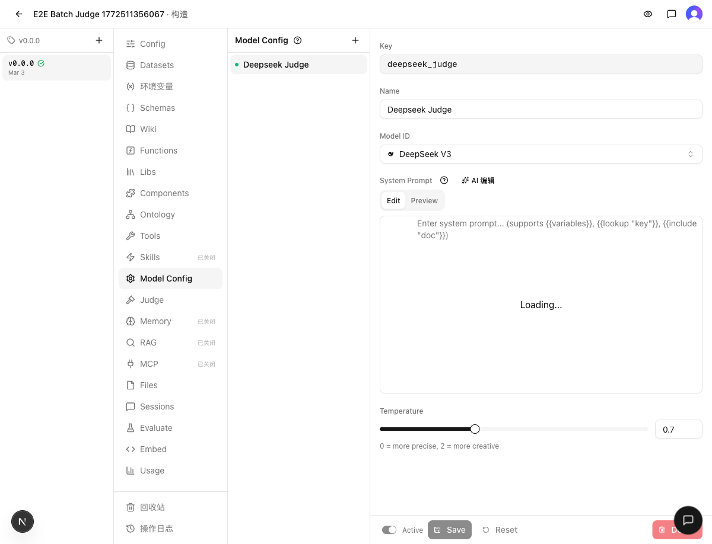
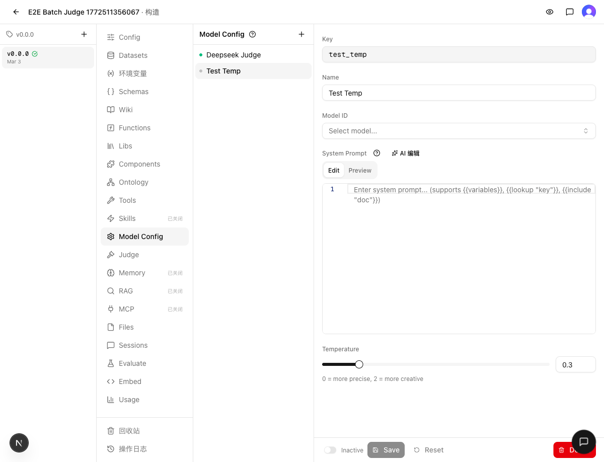

# 发布检查报告：v0.4.0

> 检查时间：2026-03-04 13:00
> 关联集成：[INTEGRATE.md](INTEGRATE.md)
> 分支：`dev` → `main`

## 1. Regression（回归验证）

### 静态检查
- `make typecheck`：✅ 通过
- `make test`：✅ 通过（126 文件 / 1437 用例）

### 结果
✅ 通过

## 2. Cross-feature（交叉验证）

### 验证场景
| 场景 | 涉及功能 | 结果 |
|------|---------|------|
| 已有 Model Config 显示温度 Slider | Temperature UI | ✅ Slider + 数字输入框正确渲染，值为 0.7 |
| 新建 Model Config 默认温度 | Temperature UI + 创建流程 | ✅ 默认值 0.3 正确 |

### 证据
| 验证项 | 截图 |
|--------|------|
| 已有配置温度 Slider |  |
| 新建配置默认温度 0.3 |  |

### 结果
✅ 通过

## 3. Migration（迁移安全）

### Schema 变更
- `modelConfigs.temperature` 默认值 0.7 → 0.3（仅应用层默认值，不改列定义）
- 无需 DB 迁移

### Migration 文件
- 无新增 drizzle 迁移文件（不需要）

### 导出格式兼容性
- 无破坏性变更，无新增导出迁移文件

### 结果
✅ 安全

## 4. Release Notes（发布说明）

### 新功能
- Model Config 温度控制增加 Slider 滑块，支持 Slider + 数字输入框双向调整（范围 0-2，步长 0.1）
- 新建 Model Config 的默认温度从 0.7 调整为 0.3，更适合确定性对话场景
- Admin 面板新增任务搜索功能，支持按标题、ID、标签、工作区搜索，搜索词持久化到 URL

### 缺陷修复
- 修复 Vercel ignoreCommand 条件反转问题，确保仅 main 分支触发构建

### 其他
- v0.3.1 发布归档

## 5. Verdict（裁定）

### 判决
✅ 发布

### 证据摘要
- **Regression**：typecheck + 1437 个测试全量通过
- **Cross-feature**：温度 Slider 渲染正确，新建配置默认值 0.3 正确
- **Migration**：仅应用层默认值变更，无 DB 迁移需求

### 阻塞项
无

### Follow-up 清单
无
