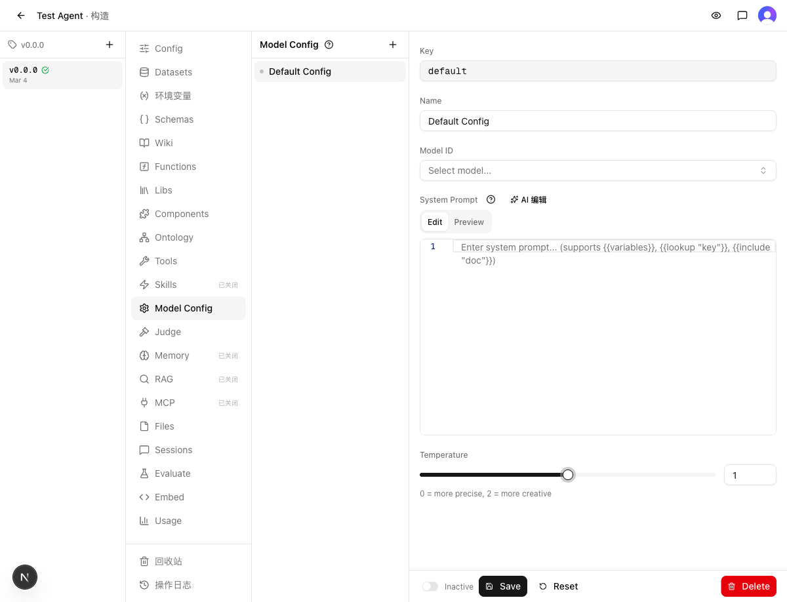

# 验收报告：Model Config 温度控制改为 Slider + 输入框组合

> 验收时间：2026-03-04 14:50
> 关联需求：[REQ.md](REQ.md)
> 关联实现：[IMPL_REPORT.md](IMPL_REPORT.md)
> 分支：`dev-model-config-temperature-ui-20260304`

## 1. Criteria Verdict（标准裁定）

### 逐项核对

| # | 验收标准 | 结论 | 偏差说明 |
|---|----------|------|----------|
| 1 | Model Config 详情表单的 temperature 区域显示 Slider + 数字输入框组合 | ✅ 通过 | Slider(role=slider) + spinbutton 同时存在 |
| 2 | Slider 范围 0-2，步长 0.1 | ✅ 通过 | aria-valuemin=0, aria-valuemax=2；ArrowRight 每次 +0.1 |
| 3 | 拖动 Slider 时，数字输入框实时同步更新 | ✅ 通过 | ArrowRight 3次：0.7→1.0，spinbutton 同步显示 |
| 4 | 在数字输入框输入合法值时，Slider 实时同步更新 | ✅ 通过 | 输入 5 → clamp 2 → slider aria-valuenow=2 |
| 5 | 输入框输入超出 0-2 范围的值时，自动 clamp 到边界 | ✅ 通过 | 输入 5 → clamped 到 2 |
| 6 | 修改温度后 dirty 检测正常，Save/Reset 按钮可用 | ✅ 通过 | 调整 Slider 后 Save/Reset 从 disabled 变为 enabled |
| 7 | 保存后温度值正确持久化 | ✅ 通过 | Save 后刷新页面，spinbutton 仍为 1（非默认 0.7） |
| 8 | 提示文字 "0 = more precise, 2 = more creative" 保留 | ✅ 通过 | paragraph 元素存在 |

### 证据

| 验证项 | 截图 |
|--------|------|
| Slider 调整到 1.0，Save/Reset 启用 |  |

### 结果
✅ 全部通过（8/8 条）

## 2. Experience Validation（体验验证）

### 用户旅程
以 FDE 视角：Agent Build → Model Config → 选 Default Config → 看到 Temperature 滑块 + 输入框 → 拖滑块调整 → 输入框精确调整 → Save → 刷新确认持久化。

### 四维度评估

| 维度 | 结果 | 说明 |
|------|------|------|
| Happy Path | ✅ | 完整路径走通，从查看到调整到保存无阻塞 |
| 流程衔接 | ✅ | Slider 和 Input 共享同一状态，切换操作方式无缝 |
| 认知负荷 | ✅ | 布局直观——左侧滑块快速定位，右侧输入框精确调节，提示文字清晰 |
| 异常恢复 | ✅ | 输入超范围值自动 clamp，Reset 按钮可恢复原值 |

### 标准覆盖反馈
无遗漏。Acceptance 标准覆盖完整。

### 结果
✅ 通过

## 3. Gap Assessment（缺口评估）

### 声明的缺口
实现报告声明 Known Gaps 为"无"。

### 发现的缺口
无

### 结果
✅ 可接受

## 4. Regression Result（回归验证）

### 静态检查
- `make typecheck`：通过
- `make test`：通过（126 文件 / 1433 用例）

### Constraint 合规
| # | 约束 | 结果 |
|---|------|------|
| 1 | 温度范围保持 0-2，默认值保持 0.7 | ✅ 未违反（新建 Config 默认 0.7，Slider min=0 max=2） |
| 2 | 复用已有 Slider 组件 | ✅ 未违反（import from @/components/ui/slider） |
| 3 | 保存/重置/脏值逻辑不变 | ✅ 未违反（dirty 比较逻辑未修改，Save/Reset 行为正常） |
| 4 | API 接口不变 | ✅ 未违反（无后端代码改动） |

### Change Set 区域验证
| 区域 | 实现报告声明 | 实际验证结果 |
|------|-------------|-------------|
| model-config-detail.tsx | Slider + Input 组合 | ✅ 正常，UI 渲染和交互如预期 |
| 测试文件 | 新增 4 个测试用例 | ✅ 全部通过 |
| guide/model-config.md | 更新 UI 描述 | ✅ 已确认更新内容准确 |

### 结果
✅ 通过

## 5. Verdict（裁定）

### 判决
✅ 合并

### 证据摘要
- **Criteria Verdict**：8/8 条验收标准全部通过
- **Experience Validation**：连续使用流畅，交互直观
- **Gap Assessment**：无缺口
- **Regression**：typecheck + 1433 测试通过，Constraint 未违反

### 阻塞项
无

### Follow-up 清单
无

## 过程备注

无
