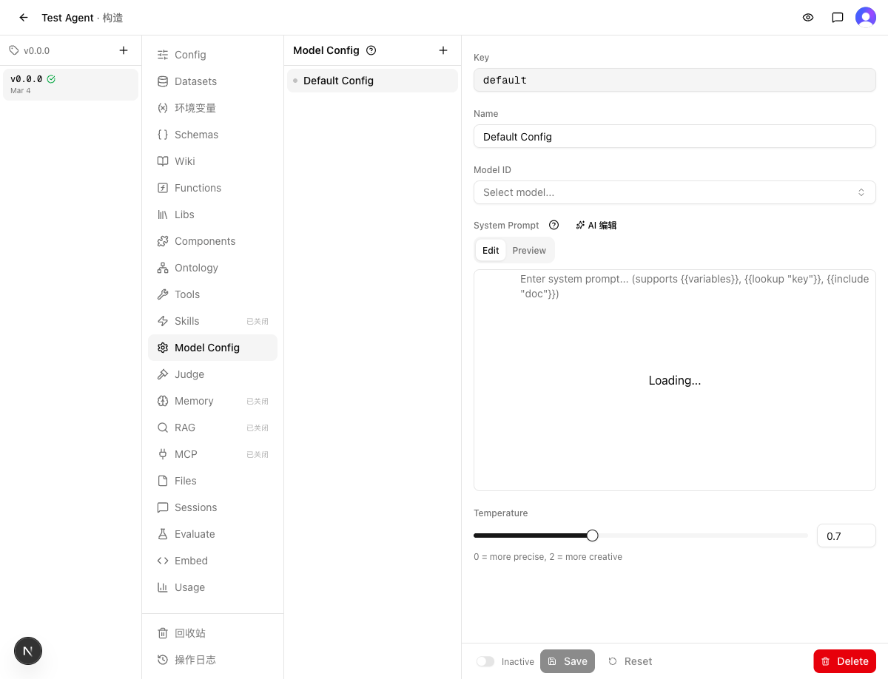
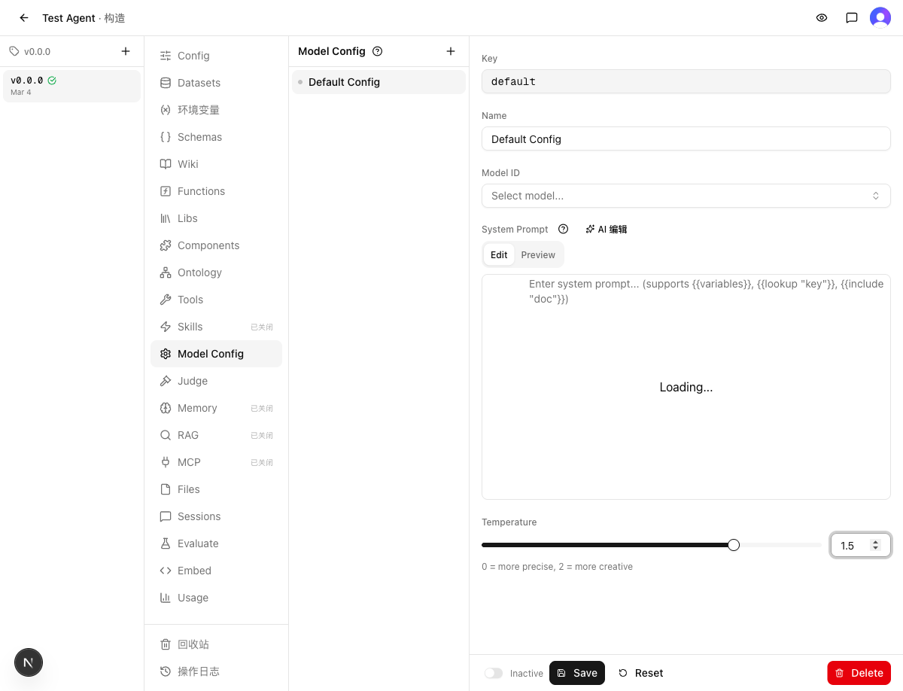

# 实现报告：Model Config 温度控制改为 Slider + 输入框组合

> 实现时间：2026-03-04 14:45
> 关联需求：[REQ.md](REQ.md)
> 分支：`dev-model-config-temperature-ui-20260304`

## 1. Solution Design（方案设计）

### 用户流程
1. 进入 Agent Build → Model Config → 选择一个配置
2. 看到 Temperature 区域：左侧 Slider + 右侧数字输入框
3. 拖动 Slider 或修改输入框来调整温度
4. Save 保存

### 系统架构
纯前端 UI 改动，复用已有的 `@/components/ui/slider`（Radix Slider），不涉及后端变更。

### 关键界面
```
Temperature
[====Slider====○================] [1.5 ↕]
0 = more precise, 2 = more creative
```
- Slider：`flex-1` 占据剩余宽度，min=0, max=2, step=0.1
- 输入框：`w-20` 固定宽度，type="number"
- 提示文字：从原来的 inline span 改为独立 `<p>` 段落

## 2. Design Rationale（设计决策）

### 决策 1：布局方式
- **选择**：Slider 和 Input 水平排列在同一行（`flex items-center gap-3`）
- **替代方案**：Slider 在上、Input 在下的垂直布局 — 不选原因：占用更多纵向空间，且失去左右对照的直观性
- **选择依据**：与 Memory Importance 滑块布局一致，项目内模式统一
- **已知妥协**：无

### 决策 2：提示文字位置
- **选择**：提示文字从 Slider/Input 行内移到下方独立段落
- **替代方案**：保持在行内（Slider 左侧 + Input 中间 + 提示右侧）— 不选原因：加入 Slider 后行内空间不足，提示文字会被挤压
- **选择依据**：独立段落更清晰，不影响 Slider 的可拖拽宽度

## 3. Change Set（变更集）

### 变更摘要
在 Model Config 详情表单的 temperature 区域加入 Slider 组件，与现有数字输入框双向联动。

### 修改
| 文件 | 改动 | 说明 |
|------|------|------|
| `web/src/components/model-config/model-config-detail.tsx` | 新增 `Slider` import + 改写 temperature 区域 UI | 核心变更：Slider + Input 组合 |
| `web/src/components/model-config/__tests__/model-config-detail.test.tsx` | 新增 4 个 temperature 测试用例 | 覆盖渲染、dirty 检测、save 传参 |
| `web/guide/model-config.md` | 更新 UI 描述 | 补充 Slider + 数字输入框说明 |

## 4. Traceability（需求追溯）

| 需求项 | 类型 | 实现位置 | 状态 |
|--------|------|----------|------|
| Slider + 数字输入框组合 | What | model-config-detail.tsx:270-290 | ✅ 已实现 |
| Slider 和输入框双向联动 | What | 同上（共享 `temperature` state） | ✅ 已实现 |
| 范围 0-2，步长 0.1 | What | Slider min/max/step + Input clamp | ✅ 已实现 |
| 显示 Slider + 输入框组合 | Acceptance | Playwright 截图确认 | ✅ 已验证 |
| Slider 范围 0-2，步长 0.1 | Acceptance | Slider props | ✅ 已验证 |
| 拖 Slider 同步输入框 | Acceptance | 共享 state | ✅ 已验证 |
| 输入框同步 Slider | Acceptance | 共享 state | ✅ 已验证 |
| 超范围值 clamp | Acceptance | Input onChange clamp 逻辑 | ✅ 已验证 |
| dirty 检测 + Save/Reset | Acceptance | dirty 逻辑未变 | ✅ 已验证 |
| 保存持久化 | Acceptance | onSave 传参测试 | ✅ 已验证 |
| 提示文字保留 | Acceptance | `<p>` 段落 | ✅ 已验证 |
| 复用已有 Slider | Constraint | `@/components/ui/slider` | ✅ 已满足 |
| UI 约束 | Constraint | label/间距样式不变 | ✅ 已满足 |
| 保存/重置/脏值逻辑不变 | Constraint | 逻辑代码未修改 | ✅ 已满足 |
| API 接口不变 | Constraint | 无后端改动 | ✅ 已满足 |

## 5. Known Gaps（已知缺口）

### 未实现项
无

### 已知限制
无

### 技术债务
无

## 验证结果

### 静态检查
- `make typecheck`：通过
- `make test`：通过，126 文件 / 1433 用例

### 功能验证

| 步骤 | 截图 |
|------|------|
| 创建 Config 后查看 temperature 区域 |  |
| 修改温度为 1.5，Save/Reset 按钮启用 |  |

### Acceptance 核对
| # | 验收标准 | 结果 |
|---|----------|------|
| 1 | 显示 Slider + 数字输入框组合 | ✅ |
| 2 | Slider 范围 0-2，步长 0.1 | ✅ |
| 3 | 拖动 Slider 时输入框同步 | ✅ |
| 4 | 输入框修改时 Slider 同步 | ✅ |
| 5 | 超范围值 clamp 到边界 | ✅ |
| 6 | 修改后 dirty 检测 + Save/Reset 可用 | ✅ |
| 7 | 保存后正确持久化 | ✅ |
| 8 | 提示文字保留 | ✅ |

### Constraint 合规
| # | 约束 | 结果 |
|---|------|------|
| 1 | 温度范围 0-2，默认值 0.7 | ✅ 未违反 |
| 2 | 复用已有 Slider 组件 | ✅ 未违反 |
| 3 | 保存/重置/脏值逻辑不变 | ✅ 未违反 |
| 4 | API 接口不变 | ✅ 未违反 |

## 过程备注

[惊讶] 工作区无 Agent、无 DB 数据，需先 db-push + db-seed + 创建 Agent 后才能自测
